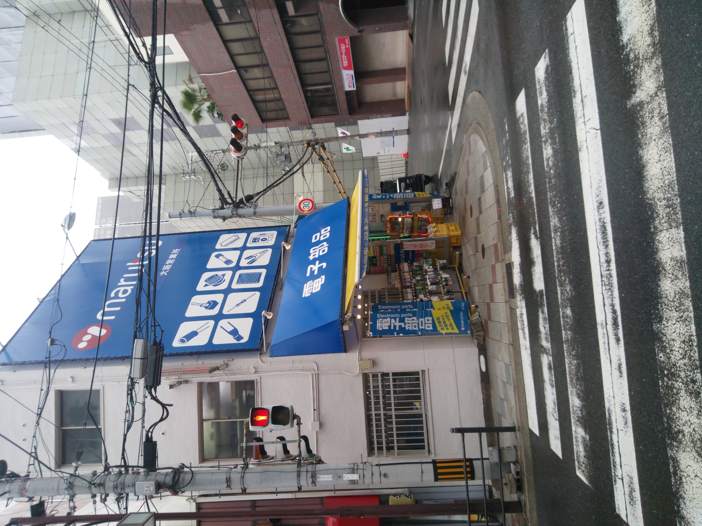
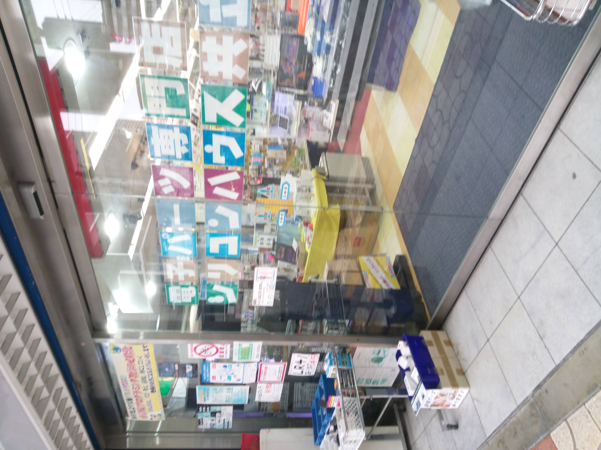

# 日本橋
2020/2/26
## 電子パーツ屋
### マルツ
普通のマルツ

### 共エレ
結構広い

### 千石
結構広い

### デジット(閉店セール中)
移転するらしいけど、いつ閉店するかすらよくわからない

ジャンクガチャ(200円)は電解コンデンサーがいっぱい入ってて良さげ

閉店セール中でMAXONのギヤードモーターが300円で買えた
巨大コンデンサーを買ってる人がいたのでもしかしたらコスパがいいのかもしれない

### 岡本無線
看板だけ見えたけど行ってない
## PCパーツ屋とか
### イオシス
普通のイオシス

### ツクモ
こんな感じ
3060の在庫があった

### じゃんばら
行ってない
### ドスパラ
こんな感じ
中古pc

### ソフマップ
行ってない

## 黒門市場
ご飯をたべるならここがいいかも
鮮魚店のお刺身が安い
あと、雑貨屋で調理器具が安く買える
- うなぎ丼ランチ850円
- マグロ３色丼 1300円くらい
- 肉屋の唐揚げ 200円
- 寿司セット 2000円